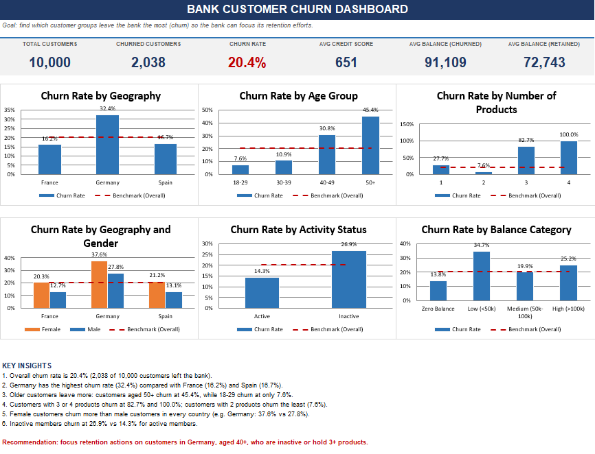

# 🏦 Bank Customer Churn Analysis (PostgreSQL)

## 📌 Project Overview
This project performs an end-to-end SQL analysis of a bank customer churn dataset (10,000 customers) using **PostgreSQL**. The goal is to investigate the demographic, geographic, financial, and behavioral drivers behind customer exits (`exited = 1`) and to estimate the financial impact in terms of lost balances.

---

## 🛠️ Tech Stack & SQL Concepts
- **Database:** PostgreSQL
- **SQL concepts used:**
  - **Aggregations & financial metrics:** `COUNT()`, `SUM()`, `AVG()`, `ROUND()`
  - **Conditional logic:** `CASE WHEN` for age categorization and credit score grouping
  - **Window functions:** `ROW_NUMBER() OVER (PARTITION BY ... ORDER BY ...)` to find the top lost accounts per country
  - **Multi-variable grouping:** churn rate across product count and customer complaints

---

## ❓ Key Business Questions
1. **Geographic distribution:** churn rate and total balance lost per country (Germany, France, Spain).
2. **Demographic risk:** churn by age cohort (`18-29`, `30-39`, `40-49`, `50+`) to isolate vulnerable groups.
3. **Product & complaint correlation:** how churn changes with the number of products and with formal complaints.
4. **Top at-risk churned accounts:** the 3 highest-balance churned customers per country.
5. **Behavioral indicators:** impact of activity status (`is_active_member`), credit tier, and tenure.

---

## 📊 Results Summary
Out of 10,000 customers, **2,038 left the bank (20.4% churn rate)**. The main findings:

 

| Factor | Finding |
|---|---|
| **Geography** | Germany has the highest churn (**32.4%**), about double France (16.2%) and Spain (16.7%). |
| **Age** | Churn rises sharply with age: **7.6%** for ages 18–29, 30.8% for 40–49, and **45.4%** for 50+. |
| **Products** | Customers with 3 or 4 products churn at **82.7%** and **100%**; those with 2 products churn the least (**7.6%**). |
| **Gender** | Women churn more than men (25.1% vs 16.5%), in every country. |
| **Activity** | Inactive members churn at **26.9%** vs 14.3% for active members. |
| **Balance** | Churned customers hold a higher average balance (91.1k vs 72.7k), so the bank loses its more valuable clients. |
| **Card type** | Little effect on churn (19–22%). |
| **Complaints** | Almost all customers who filed a complaint left (~99.5%), which suggests complaints may be recorded at or after exit. |
| **Combined effect** | German customers aged 50+ show the highest churn of all (**61%**). |

---

## 💡 Recommendation
Focus retention efforts on **customers in Germany, aged 40+, who are inactive or hold 3+ products**.
